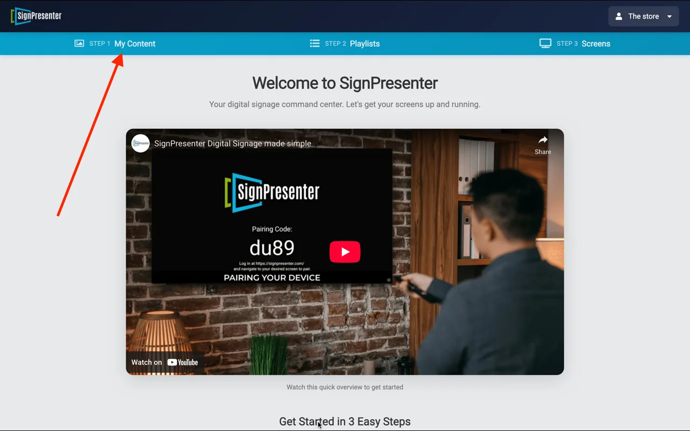
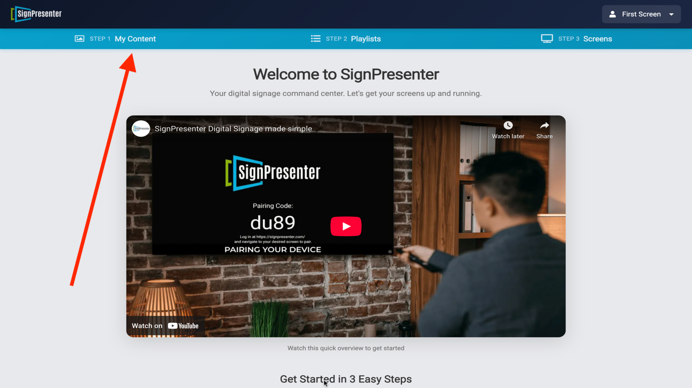
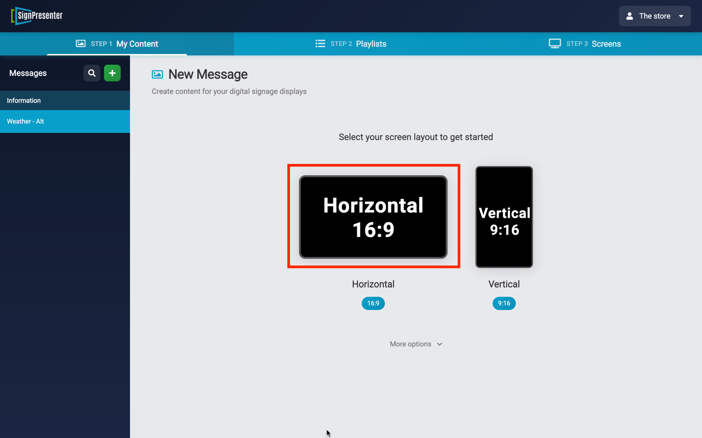
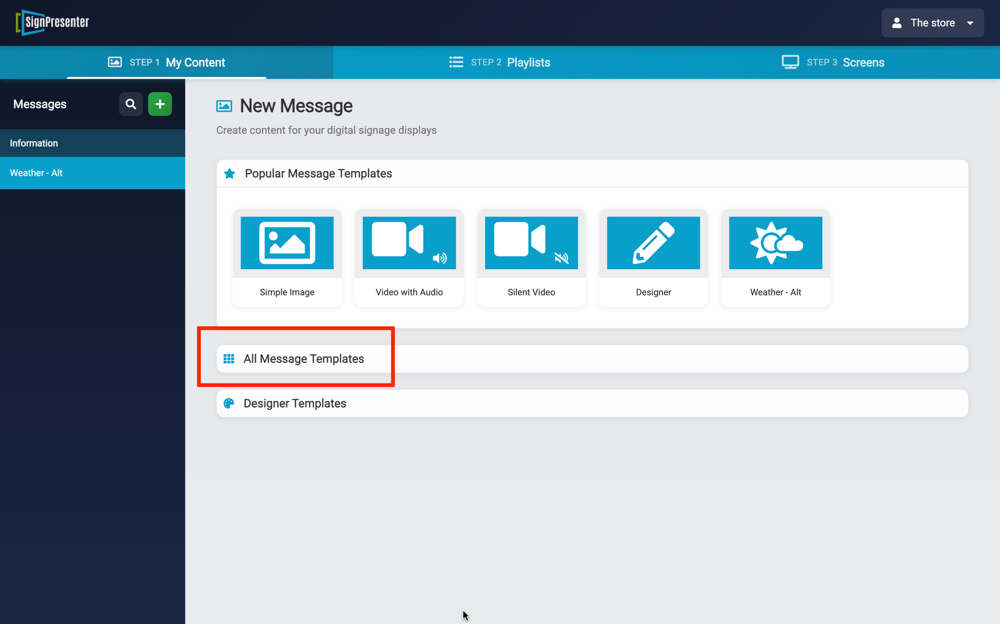
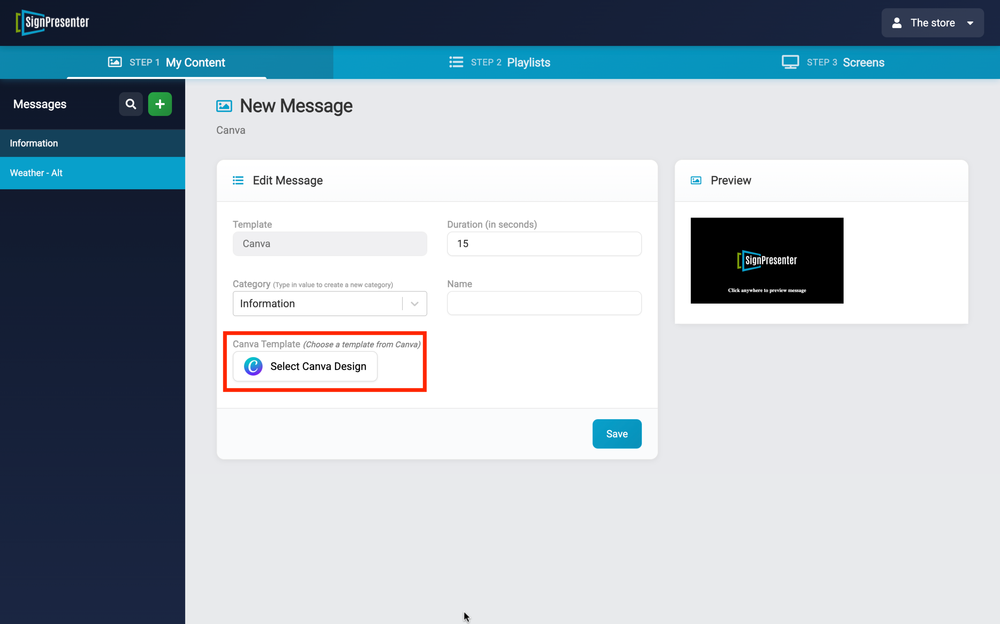
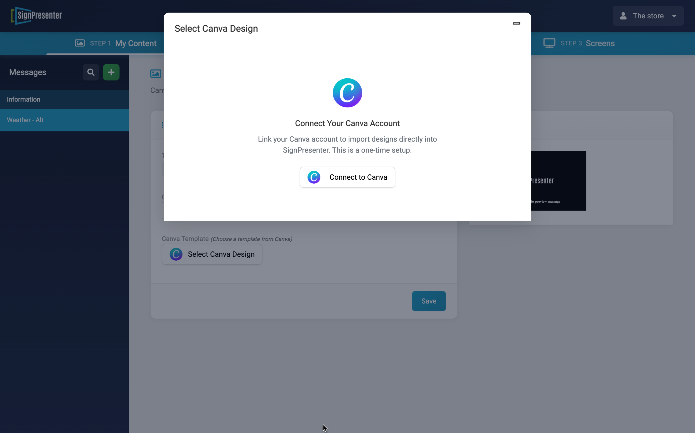

## Connect Your Canva Account to SignPresenter

SignPresenter lets you pull designs directly from your Canva account and display them on your screens. It is simple to connect to any Canva account and takes just a few clicks.

> **Note:** Canva integration currently supports **horizontal (16:9) screens only**. Vertical support is coming soon. Canva can only pull in **images** at this time.

> **Best Practice:** Start your Canva designs at a minimum of **1920 x 1080** pixels so they look sharp on your screens.

---

---

<!-- Lightbox -->

  &times;
  

<strong>Step 1 — Go to My Content</strong>

 
Click on <strong>Step 1: My Content</strong> at the top of the screen, then click the green <strong>+</strong> button to create a new message.
  

Click image to enlarge

<strong>Step 2 — Select the Horizontal layout</strong>

 
Choose <strong>Horizontal 16:9</strong> for your screen layout.
  

Click image to enlarge

<strong>Step 3 — Open All Message Templates</strong>

 
Click <strong>All Message Templates</strong> to see the full list of content types.
  

Click image to enlarge

<strong>Step 4 — Select the Canva template</strong>

 
Scroll down and click the <strong>Canva</strong> option in the template list.
  

Click image to enlarge

<strong>Step 5 — Select Canva Design</strong>

 
Click the <strong>Select Canva Design</strong> button to open the Canva connection screen.
  

Click image to enlarge

<strong>Step 6 — Connect your Canva account</strong>

 
If this is your first time, you will see a <strong>Connect Your Canva Account</strong> prompt. Click <strong>Connect to Canva</strong> — this is a one-time setup. After connecting, you can browse and select any design from your Canva library.
  
Give the message a <strong>Name</strong>, choose a <strong>Category</strong>, set the <strong>Duration</strong>, and click <strong>Save</strong>.
  

Click image to enlarge

---

That's it! Your Canva design will now be available to add to any playlist on your horizontal screens.
