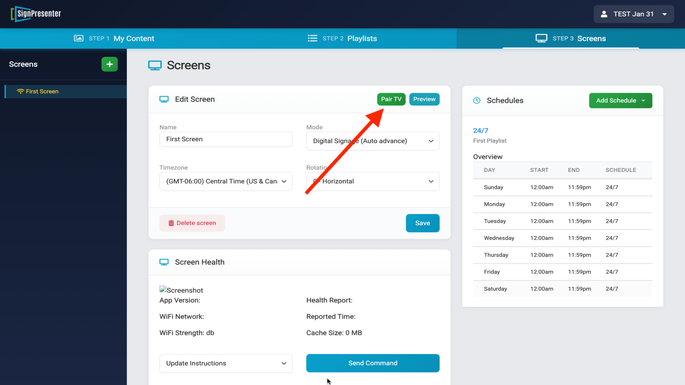

## Getting Started with Sign Presenter

Set up your first screen in three simple steps. Watch our quick setup video or follow the instructions below.

---

## Step 1: Create Your First Message

A message is any piece of content displayed on your screen. Let's start by creating a simple image message. [Watch detailed tutorial →](https://www.youtube.com/watch?v=xwwe6H3Mn9M)

1. Click on the **Messages** tab and choose your screen size (most cases: Horizontal)
2. Select the **Simple Image** template
3. Fill in the details:
   - **Category**: Create a folder name to organize your messages
   - **Name**: Give your message a descriptive name
   - **Duration**: How long the message should display
4. **Upload Your Image**:
   - Click the black box that says "Upload Your Image"
   - Click the **Upload** button in the top right corner
   - Choose your image and click **Open**
   - Adjust the crop if needed, then click **Update**
5. Click **Save**

**Confirmation**: If your message appears in the category folder on the left, your progress has been saved.

---

## Step 2: Create a Playlist

A playlist is a collection of messages that play in sequence. A default "Custom Playlist" with a weather message is already created for you. [Watch detailed tutorial →](https://www.youtube.com/watch?v=ZiIwf_F0Veg)

1. Click on the **Playlists** tab and select **Horizontal**
2. Open your **Custom Playlist** (or create a new one)
3. Under **Available Content**, select your category folder
4. Click on your message to add it to the playlist
5. Add more messages by clicking them
6. Arrange messages by dragging them up or down
7. Remove messages by clicking the trash can icon
8. Click **Save** when done

Your playlist is now ready to display on your screen.

---

## Step 3: Connect Your Screen

### Choose Your Device

The easiest option for most users is the [**Fire TV Stick HD**](https://www.amazon.com/dp/B0CQMRKRV5) ($24.99). You can also use any Android device running 10.0 or newer.

[See all compatible devices →](https://support.signpresenter.com/topics/devicessignpresenterworkson.html)

### Install the Sign Presenter App

**Option 1: Install from Your Device**
1. Plug your device into your TV and complete the initial setup (WiFi, account login, software updates)
2. Click the **Search** icon and type "Sign Presenter"
3. Download and install the app

**Option 2: Install from Your Browser**
1. Visit the app page for your device:
   - [Amazon App Store](https://www.amazon.com/Sign-Presenter/dp/B07V4GF4SZ/)
   - [Google Play Store](https://play.google.com/store/apps/details?id=com.signpresenter.screen&hl=en_US)
2. Select your device and click **Deliver**
3. The app will appear on your device in a few minutes

### Pair Your Device

1. Open the Sign Presenter app on your TV - you'll see a 4-digit pairing code
2. In your Sign Presenter account, go to **Step 3: Screens**
3. Select **First Screen** from the left sidebar
4. Scroll down and make sure your playlist is selected under **Playlist**
5. Click **Save**, then click the **Pair TV** button at the top

6. Enter the 4-digit code displayed on your TV
7. Click **Pair TV**

8. On your device, select **Run Schedule**

Congratulations! You've successfully connected your screen and your content is now playing.

---

## Need Help?

We're here to help you get set up:

- **Schedule a Demo**: [Book a 15-minute screen share](https://calendly.com/mike-1021/15-min-screen-share-demo-of-sign-presenter)
- **Call or Text**: [918-994-2638](tel:918-994-2638)
- **Email**: [support@signpresenter.com](mailto:support@signpresenter.com)

